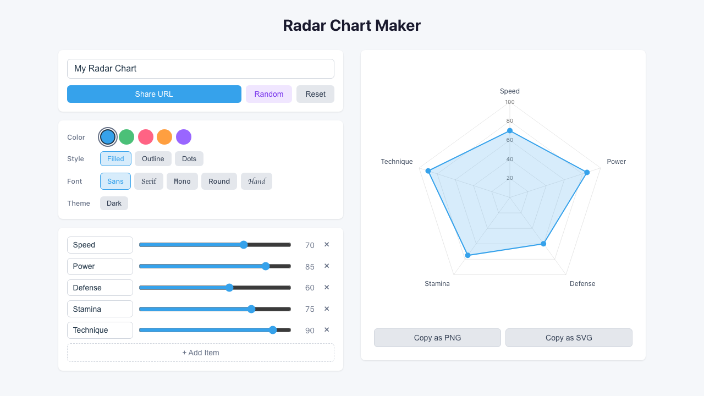
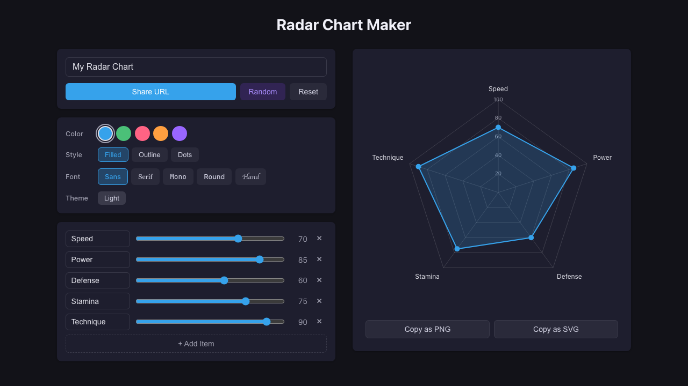

# Radar Chart Maker

A web app for creating and sharing custom radar charts. Build your chart by adding items and adjusting values, then share it via URL.

**Live:** https://radar-chart.ohbarye.workers.dev/

| Light | Dark |
|:---:|:---:|
|  |  |

## Features

- Real-time radar chart editing with arbitrary items and values
- URL-based sharing — chart data is encoded in the URL, no backend needed
- Copy as PNG or SVG to clipboard
- Light / Dark mode with OS preference detection
- 5 color themes, 3 chart styles (filled/outline/dots), 5 font choices
- Random chart generation
- Responsive layout (desktop: 2-column, mobile: stacked)

## Tech Stack

- React 19 + TypeScript
- Chart.js 4 + react-chartjs-2
- Vite 7
- Cloudflare Workers (static deployment)
- lz-string (URL compression)
- Vitest (testing)

## Development

```bash
npm install
npm run dev      # Start dev server
npm run test     # Run tests
npm run lint     # Run ESLint
npm run build    # Type check + build
npm run deploy   # Build + deploy to Cloudflare Workers
```

Requires Node 24 (managed via [mise](https://mise.jdx.dev/)).
